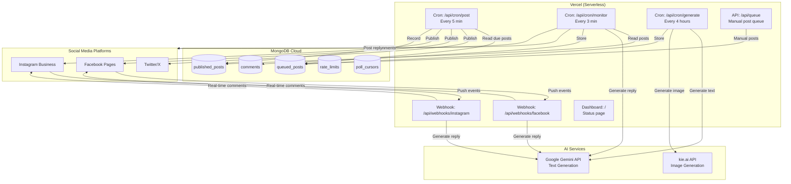
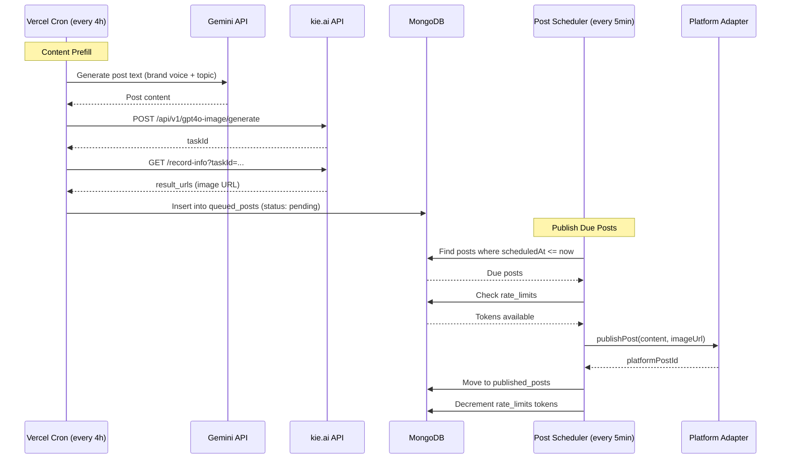
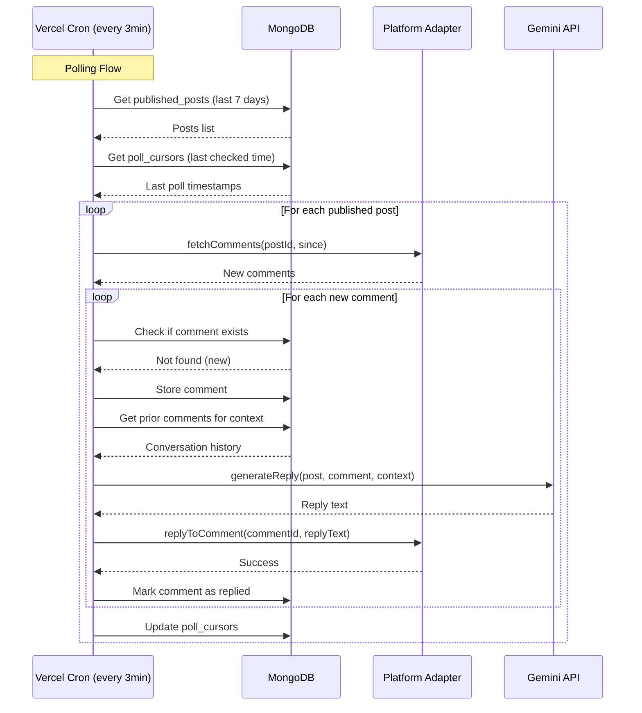
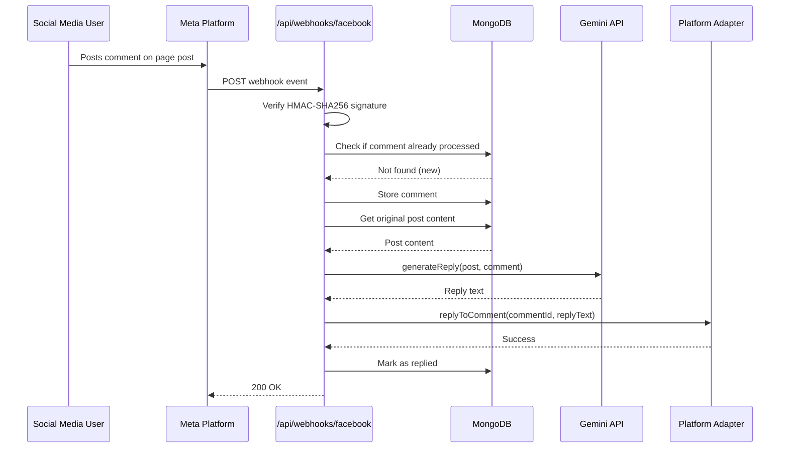
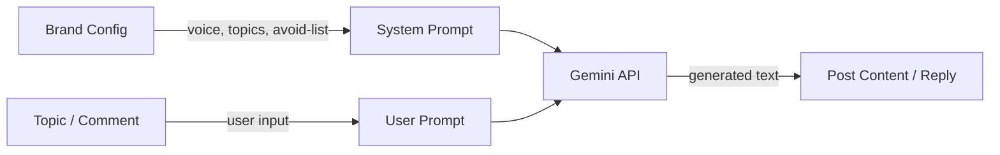
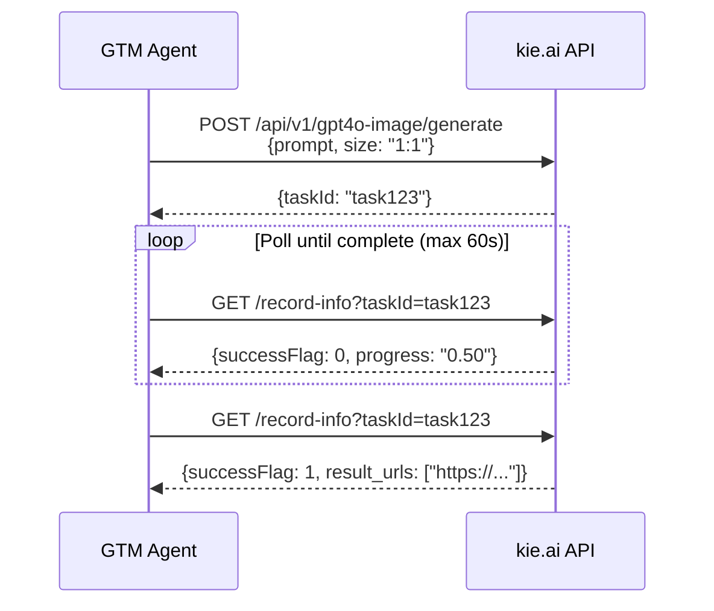
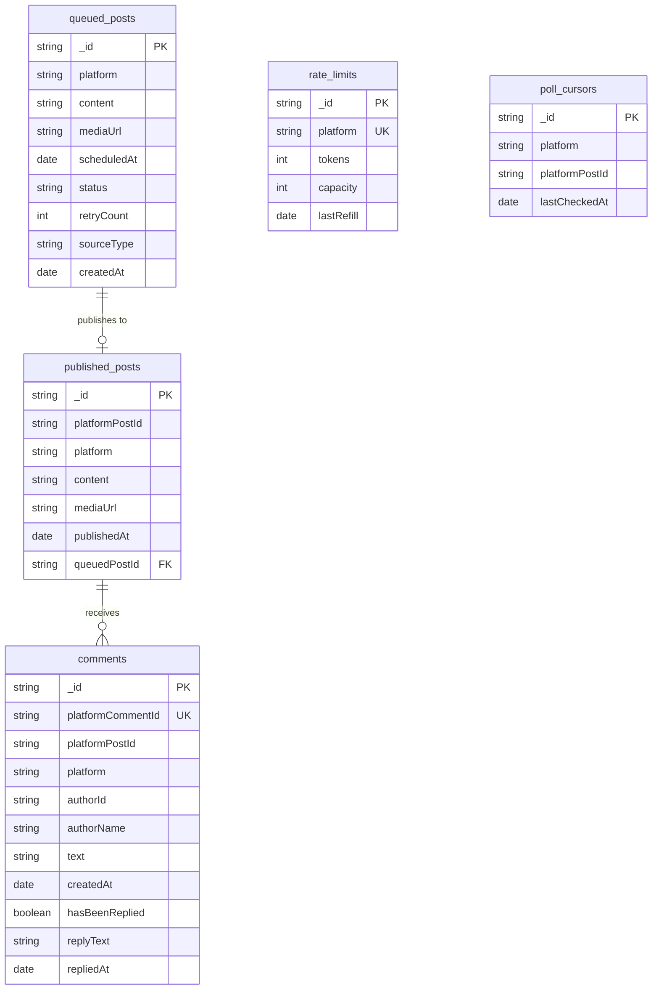
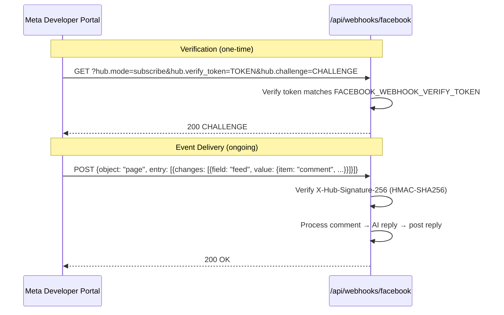
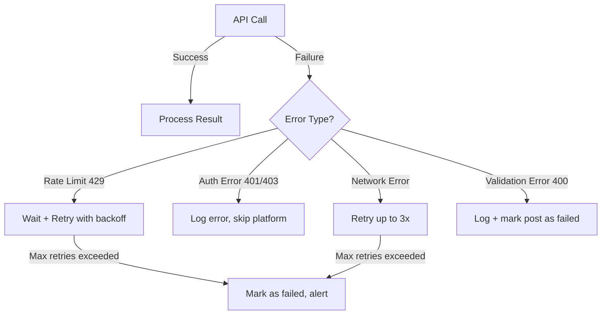
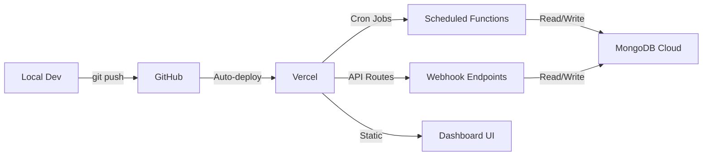

# GTM Agent — Autonomous Social Media Agent

## Overview

GTM Agent is an autonomous social media management system that posts AI-generated content, monitors comments, and auto-replies across **Twitter/X**, **Facebook Pages**, and **Instagram Business**. Deployed on **Vercel** as a serverless application with scheduled cron jobs.

---

## Tech Stack

| Component | Technology |
|-----------|-----------|
| Framework | Next.js 15 (App Router) |
| Language | TypeScript |
| AI Text | Google Gemini (`@google/genai`) |
| AI Images | kie.ai API (GPT-4o image generation) |
| Database | MongoDB Cloud |
| Twitter/X | `twitter-api-v2` (OAuth 1.0a) |
| Facebook/Instagram | Meta Graph API v22.0 (`axios`) |
| Deployment | Vercel (serverless + cron jobs) |
| Webhooks | Next.js API Routes |

---

## System Architecture



---

## Data Flow Diagrams

### Posting Pipeline



### Comment Monitoring & Reply



### Webhook Flow (Facebook/Instagram)



---

## Project Structure

```
GTM_Agent/
├── package.json
├── tsconfig.json
├── next.config.ts
├── vercel.json                          # Cron job schedules
├── .env.local                           # Secrets (gitignored)
├── .env.example                         # Template for secrets
├── .gitignore
├── config.json                          # Brand voice, topics, schedule
├── ARCHITECTURE.md                      # This file
│
├── src/
│   ├── app/
│   │   ├── layout.tsx
│   │   ├── page.tsx                     # Status dashboard
│   │   └── api/
│   │       ├── cron/
│   │       │   ├── post/route.ts        # Publish due posts
│   │       │   ├── monitor/route.ts     # Poll comments & auto-reply
│   │       │   └── generate/route.ts    # AI content prefill
│   │       ├── webhooks/
│   │       │   ├── facebook/route.ts    # FB real-time events
│   │       │   └── instagram/route.ts   # IG real-time events
│   │       ├── queue/route.ts           # Manual post queue (POST/GET)
│   │       └── health/route.ts          # Health check
│   │
│   └── lib/
│       ├── config.ts                    # Env + config.json loader
│       ├── types.ts                     # All shared TypeScript interfaces
│       │
│       ├── platforms/
│       │   ├── base.ts                  # Abstract PlatformAdapter
│       │   ├── twitter.ts               # Twitter/X adapter
│       │   ├── facebook.ts              # Facebook Pages adapter
│       │   └── instagram.ts             # Instagram Business adapter
│       │
│       ├── ai/
│       │   ├── content-generator.ts     # Gemini text generation
│       │   └── image-generator.ts       # kie.ai image generation
│       │
│       ├── services/
│       │   ├── post-scheduler.ts        # Fetch + publish due posts
│       │   ├── comment-monitor.ts       # Poll all platforms for comments
│       │   ├── comment-responder.ts     # Generate + post AI replies
│       │   └── content-prefill.ts       # Fill queue for upcoming slots
│       │
│       ├── db/
│       │   ├── client.ts               # MongoDB connection singleton
│       │   ├── collections.ts          # Collection setup + indexes
│       │   └── repositories/
│       │       ├── posts.ts            # queued_posts + published_posts
│       │       ├── comments.ts         # comments + replies
│       │       └── config.ts           # rate_limits + poll_cursors
│       │
│       └── utils/
│           ├── retry.ts                # Exponential backoff with jitter
│           ├── rate-limiter.ts         # Token bucket (MongoDB-persisted)
│           └── errors.ts              # Custom error classes
│
└── public/                             # Static assets
```

---

## Module Design

### Core Types (`src/lib/types.ts`)

```typescript
type Platform = 'twitter' | 'facebook' | 'instagram';

interface QueuedPost {
  _id: string;
  platform: Platform;
  content: string;
  mediaUrl?: string;           // Image URL from kie.ai
  scheduledAt: Date;
  status: 'pending' | 'published' | 'failed';
  retryCount: number;
  sourceType: 'ai_generated' | 'manual';
  createdAt: Date;
}

interface PublishedPost {
  _id: string;
  platformPostId: string;     // ID from the platform
  platform: Platform;
  content: string;
  mediaUrl?: string;
  publishedAt: Date;
  queuedPostId: string;
}

interface Comment {
  platformCommentId: string;
  platformPostId: string;
  platform: Platform;
  authorId: string;
  authorName?: string;
  text: string;
  createdAt: Date;
  hasBeenReplied: boolean;
  replyText?: string;
  repliedAt?: Date;
}

interface PostResult {
  success: boolean;
  platformPostId?: string;
  error?: string;
}

interface CommentResult {
  success: boolean;
  platformReplyId?: string;
  error?: string;
}
```

### Platform Adapter (`src/lib/platforms/base.ts`)

```typescript
abstract class PlatformAdapter {
  abstract readonly platform: Platform;
  abstract publishPost(post: QueuedPost): Promise<PostResult>;
  abstract fetchComments(platformPostId: string, since?: Date): Promise<Comment[]>;
  abstract replyToComment(comment: Comment, replyText: string): Promise<CommentResult>;
  abstract verifyCredentials(): Promise<boolean>;
}
```

### Platform Details

| Platform | Post Method | Comment Fetch | Reply Method | Auth |
|----------|------------|---------------|-------------|------|
| **Twitter/X** | `POST /2/tweets` | Poll `search/recent` with `conversation_id` | `POST /2/tweets` with `in_reply_to_tweet_id` | OAuth 1.0a |
| **Facebook** | `POST /{page-id}/feed` | `GET /{post-id}/comments` + Webhooks | `POST /{comment-id}/comments` | Page Access Token |
| **Instagram** | Two-step: `POST /{ig-id}/media` → `POST /{ig-id}/media_publish` | `GET /{media-id}/comments` + Webhooks | `POST /{comment-id}/replies` | Page Access Token |

---

## AI Integration

### Gemini — Text Generation



- **Package**: `@google/genai`
- **Post generation**: System prompt with brand voice → platform-appropriate content with hashtags
- **Reply generation**: Includes original post + incoming comment + prior conversation context
- **Config**: Model, temperature, max tokens all configurable in `config.json`

### kie.ai — Image Generation



- **Endpoint**: `https://api.kie.ai/api/v1/gpt4o-image/generate`
- **Auth**: Bearer token
- **Async**: Returns taskId → poll `record-info` endpoint until `successFlag: 1`
- **Image URLs expire in 14 days** — download and re-host if needed

---

## MongoDB Collections



### Indexes
- `queued_posts`: `{ status: 1, scheduledAt: 1 }` — fast lookup for due posts
- `published_posts`: `{ platform: 1, publishedAt: -1 }` — recent posts per platform
- `comments`: `{ platformCommentId: 1, platform: 1 }` unique — deduplication
- `poll_cursors`: `{ platform: 1, platformPostId: 1 }` unique

---

## Configuration

### Environment Variables (`.env.local`)

```bash
# Twitter/X
TWITTER_APP_KEY=
TWITTER_APP_SECRET=
TWITTER_ACCESS_TOKEN=
TWITTER_ACCESS_SECRET=

# Facebook / Instagram (shared Meta tokens)
FACEBOOK_PAGE_ID=
FACEBOOK_PAGE_ACCESS_TOKEN=
FACEBOOK_APP_SECRET=
FACEBOOK_WEBHOOK_VERIFY_TOKEN=
INSTAGRAM_BUSINESS_ACCOUNT_ID=

# AI
GEMINI_API_KEY=
KIE_AI_API_KEY=

# MongoDB
MONGODB_URI=mongodb+srv://...

# Vercel Cron
CRON_SECRET=

# App
NEXT_PUBLIC_APP_URL=https://your-app.vercel.app
```

### Brand Config (`config.json`)

```json
{
  "brand": {
    "name": "Your Brand",
    "voice": "professional yet approachable, with a touch of humor",
    "topics": [
      "industry trends",
      "product updates",
      "customer success stories",
      "tips and best practices"
    ],
    "hashtags": {
      "default": ["#YourBrand"],
      "twitter": ["#Tech", "#Innovation"],
      "instagram": ["#Business", "#Growth", "#Motivation"]
    },
    "avoid": ["politics", "religion", "competitor bashing"]
  },
  "platforms": {
    "twitter": {
      "enabled": true,
      "maxPostsPerDay": 10,
      "characterLimit": 280
    },
    "facebook": {
      "enabled": true,
      "maxPostsPerDay": 5
    },
    "instagram": {
      "enabled": true,
      "maxPostsPerDay": 5
    }
  },
  "scheduling": {
    "postTimesUTC": ["09:00", "13:00", "18:00"],
    "timezone": "America/Los_Angeles"
  },
  "ai": {
    "model": "gemini-2.0-flash",
    "temperature": 0.7,
    "replyContextDepth": 5,
    "skipReplyPatterns": ["^spam", "unsubscribe", "buy now"]
  }
}
```

---

## Vercel Cron Configuration

```json
// vercel.json
{
  "crons": [
    {
      "path": "/api/cron/post",
      "schedule": "*/5 * * * *"
    },
    {
      "path": "/api/cron/monitor",
      "schedule": "*/3 * * * *"
    },
    {
      "path": "/api/cron/generate",
      "schedule": "0 */4 * * *"
    }
  ]
}
```

| Cron Job | Schedule | Purpose |
|----------|----------|---------|
| `/api/cron/post` | Every 5 min | Check for due posts and publish them |
| `/api/cron/monitor` | Every 3 min | Poll platforms for new comments, auto-reply |
| `/api/cron/generate` | Every 4 hours | Generate AI content + images for upcoming slots |

---

## Webhook Setup

### Facebook Page Webhook



### Required Meta Permissions
- `pages_manage_posts` — post to page
- `pages_read_engagement` — read comments
- `pages_manage_engagement` — reply to comments
- `pages_manage_metadata` — subscribe to webhooks
- `instagram_basic` — read IG media
- `instagram_content_publish` — post to IG
- `instagram_manage_comments` — read/reply IG comments

---

## Rate Limits & Constraints

| Platform | Posting Limit | Comment Monitoring | Notes |
|----------|--------------|-------------------|-------|
| **Twitter/X** | Free: ~500/mo, Basic ($100): 50K/mo | Polling only (no webhooks) | Search limited to last 7 days |
| **Facebook** | No hard limit (use BUC guidelines) | Webhooks + polling fallback | Page tokens expire in 60 days |
| **Instagram** | 25 API posts per 24h | Webhooks + polling fallback | Requires image/video (no text-only) |
| **kie.ai** | Pay-per-call (~$0.03/image) | N/A | Images expire in 14 days |
| **Gemini** | Per-token pricing | N/A | Rate limits vary by model |

---

## Error Handling Strategy



- **Exponential backoff**: base 2s, factor 2x, max 3 attempts, with jitter
- **Rate limiter**: Token bucket persisted in MongoDB (survives serverless cold starts)
- **Failed posts**: Retry up to 3x, then mark as `failed` in database
- **Logging**: Structured JSON logs captured by Vercel

---

## Security

- **Webhook verification**: HMAC-SHA256 signature check on all Meta webhook events
- **Cron auth**: Vercel `CRON_SECRET` header validation on all cron endpoints
- **Secrets**: All API keys in environment variables, never in code
- **MongoDB**: Connection string with authentication, IP whitelist optional
- **No credentials in git**: `.env.local` in `.gitignore`

---

## Deployment



1. Push code to GitHub
2. Vercel auto-deploys from main branch
3. Set environment variables in Vercel dashboard
4. Cron jobs auto-register from `vercel.json`
5. Configure Meta webhook URL: `https://your-app.vercel.app/api/webhooks/facebook`

---

## Implementation Phases

### Phase 1: Project Foundation
- Initialize Next.js 15, install dependencies
- Types, config, utilities (retry, rate-limiter, errors)
- MongoDB connection + collections + repositories

### Phase 2: Platform Adapters
- Abstract base adapter
- Twitter, Facebook, Instagram implementations

### Phase 3: AI Integration
- Gemini content generator (posts + replies)
- kie.ai image generator (async with polling)

### Phase 4: Core Services
- Post scheduler, comment monitor, comment responder, content prefill

### Phase 5: API Routes
- Cron handlers (post, monitor, generate)
- Webhook handlers (Facebook, Instagram)
- Manual queue API + health check

### Phase 6: Dashboard & Deploy
- Status dashboard page
- Vercel deployment + cron configuration
- Meta webhook registration
